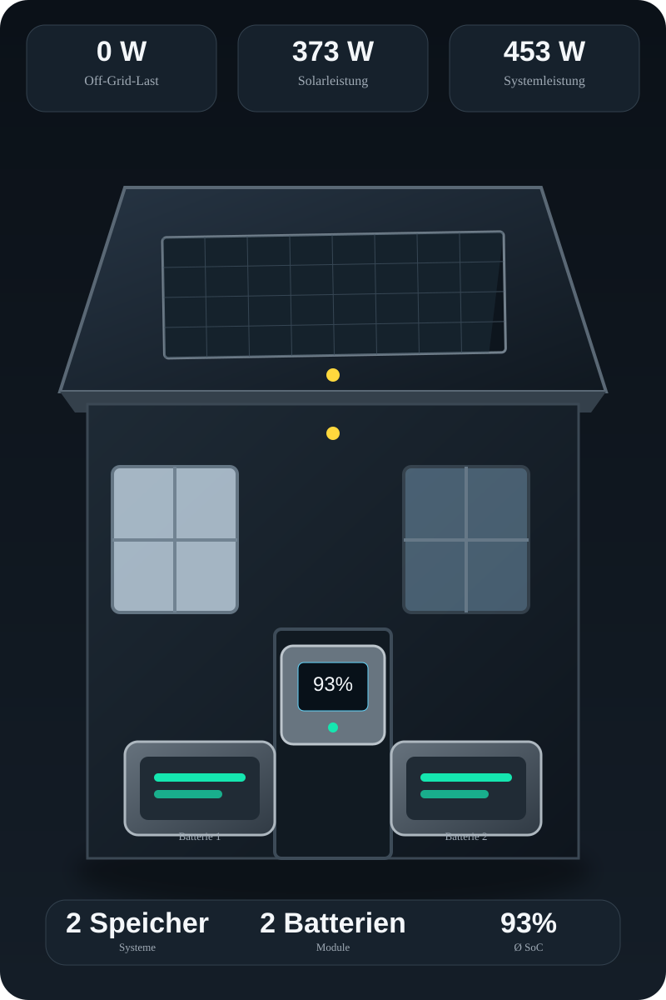
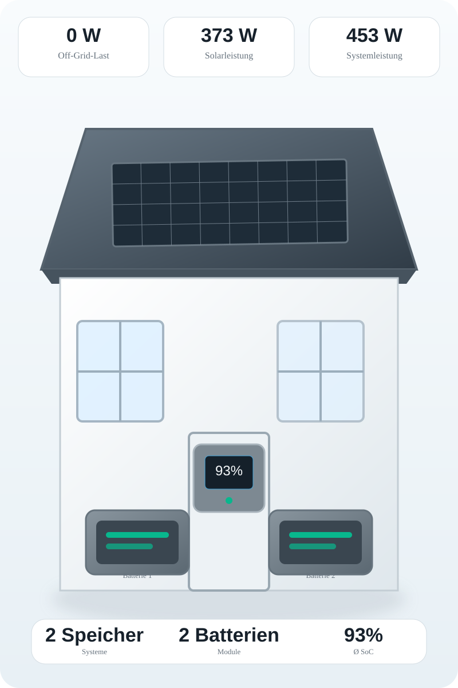

# Zendure Energy Card

Eine HACS-Lovelace-Karte für Zendure SolarFlow/Speichersysteme. **Version 0.4.0** verwendet eine hohe, smartphone-optimierte Portrait-Darstellung nach dem neuen Zendure-inspirierten Design: Haus, großes Solardach, Wechselrichter, Speicher- und Batteriemodule sowie animierte Energieflüsse.

## Vorschau

### Dunkel



### Hell



Die beiden Vorschauen zeigen die neue v0.4.0-Grafik. Die tatsächliche Lovelace-Karte erzeugt die Szene dynamisch aus den aktuellen Home-Assistant-Zuständen und passt Speicher, Batterien, SoC und Energieflüsse automatisch an.

## Voraussetzungen

- Home Assistant 2026.2 oder neuer
- installierte Zendure Home Assistant Integration (`zendure_ha`)
- HACS

Die Karte liest ausschließlich bestehende `sensor.*`-Entitäten. Es werden keine zusätzlichen Zendure-Sensoren erzeugt.

## Installation mit HACS

**Wichtig:** Diese Karte ist ein **HACS Dashboard-Element (Plugin)**, keine Home-Assistant-Integration.

1. HACS → **Benutzerdefinierte Repositories** öffnen.
2. `https://github.com/leonsio/zendure-energy-card` hinzufügen.
3. Als Typ **Dashboard** auswählen.
4. **Zendure Energy Card** installieren bzw. auf Version 0.4.0 aktualisieren.
5. Browser/WebView vollständig neu laden.
6. Dashboard bearbeiten → **Karte hinzufügen** → **Zendure Energy Card**.

Bei HACS-Dashboard-Elementen wird die JavaScript-Datei aus `dist/` installiert und als Lovelace-Ressource eingebunden. Eine `custom_components`-Integration und ein Neustart von Home Assistant sind für diese Karte nicht erforderlich.

### Falls bereits eine ältere Version installiert ist

Entferne die bisherige **Zendure Energy Card** in HACS, installiere das Repository anschließend erneut als **Dashboard** und lade den Browser vollständig neu. Falls unter **Einstellungen → Dashboards → Ressourcen** noch eine alte Resource eingetragen ist, diese entfernen.

## Verwendung

```yaml
type: custom:zendure-energy-card
```

Optional:

```yaml
type: custom:zendure-energy-card
title: SolarFlow
max_systems: 4
max_batteries: 8
```

## Automatische Erkennung

Die Karte erkennt die von `zendure_ha` bereitgestellten Sensoren über die Entity-ID-Endungen:

- `sensor.*_grid_off_power`
- `sensor.*_solar_input_power`
- `sensor.*_electric_level`
- `sensor.*_pack_num`

Ein Speichersystem wird über sein `*_electric_level` erkannt. `*_pack_num` bestimmt die Anzahl der zugehörigen Batterien. Wenn `pack_num` nicht verfügbar ist, wird vorübergehend eine Batterie für das erkannte System dargestellt.

## Berechnungen

### Off-Grid-Steckdosenlast

```text
Sum(max(grid_off_power, 0))
```

Negative Werte werden **nicht** als Last berücksichtigt.

### Solarleistung

```text
Sum(max(solar_input_power, 0))
+ Sum(abs(grid_off_power)) für alle negativen grid_off_power
```

Ein negativer `grid_off_power`-Wert wird damit als zusätzliche Solarleistung behandelt.

### Batterie-SoC

Der angezeigte SoC ist der arithmetische Mittelwert aller verfügbaren `*_electric_level`-Sensoren und wird auf 0–100 % begrenzt.

## Darstellung 0.4.0

- **hohe Portrait-Karte**, auf Smartphones ungefähr 3/4 der Bildschirmhöhe
- deutlich größere Haus-/SolarFlow-Szene
- großes Dach mit Solarmodulen und Zellraster
- zentraler Wechselrichter
- Speicher und Zusatzbatterien werden automatisch anhand der Zendure-Sensoren dargestellt
- eigener SoC pro erkanntem Speichersystem
- zentrale Anzeige `X Speicher · Y Batterien`
- animierte Energieflusslinien mit Richtungspfeilen
- Gelb = Solar, Grün = Batterie, Blau = Verbrauch, Violett = Netz
- Animation reduziert sich automatisch bei `prefers-reduced-motion`
- Hell- und Dunkelmodus folgen automatisch dem Home-Assistant-Theme
- responsive für Smartphone, Tablet und Desktop

## Architektur

Die Karte ist bewusst nur ein Lovelace-Frontend-Plugin. Sie verwendet die von Home Assistant bereitgestellten `hass.states` und verändert weder das Zendure-Repository noch die `zendure_ha`-Integration.

## Lizenz

MIT
